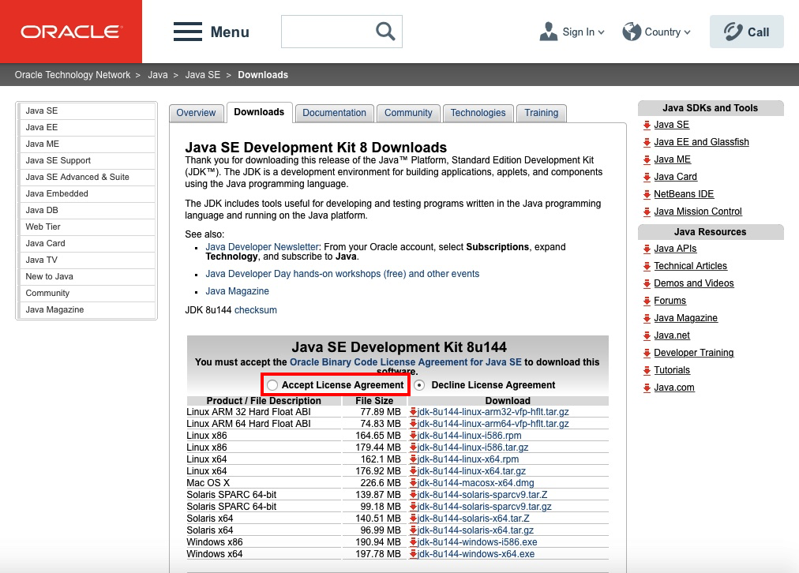
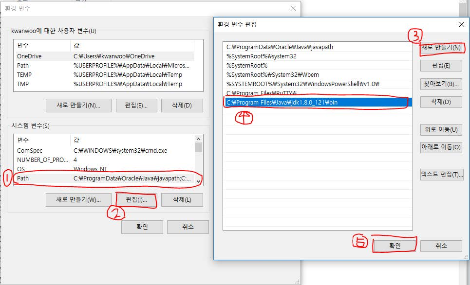
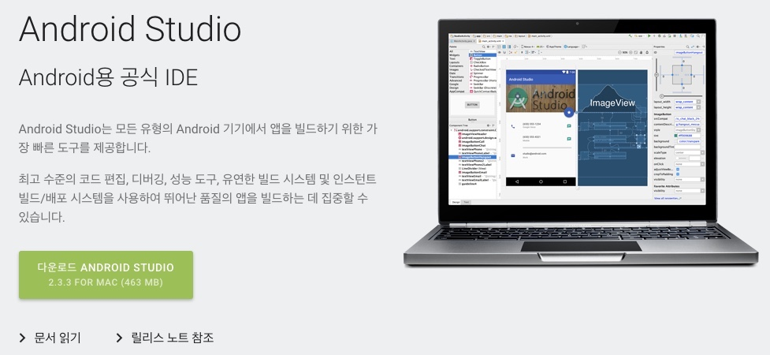
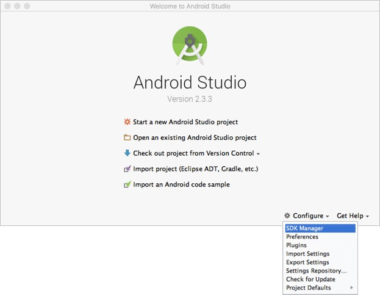
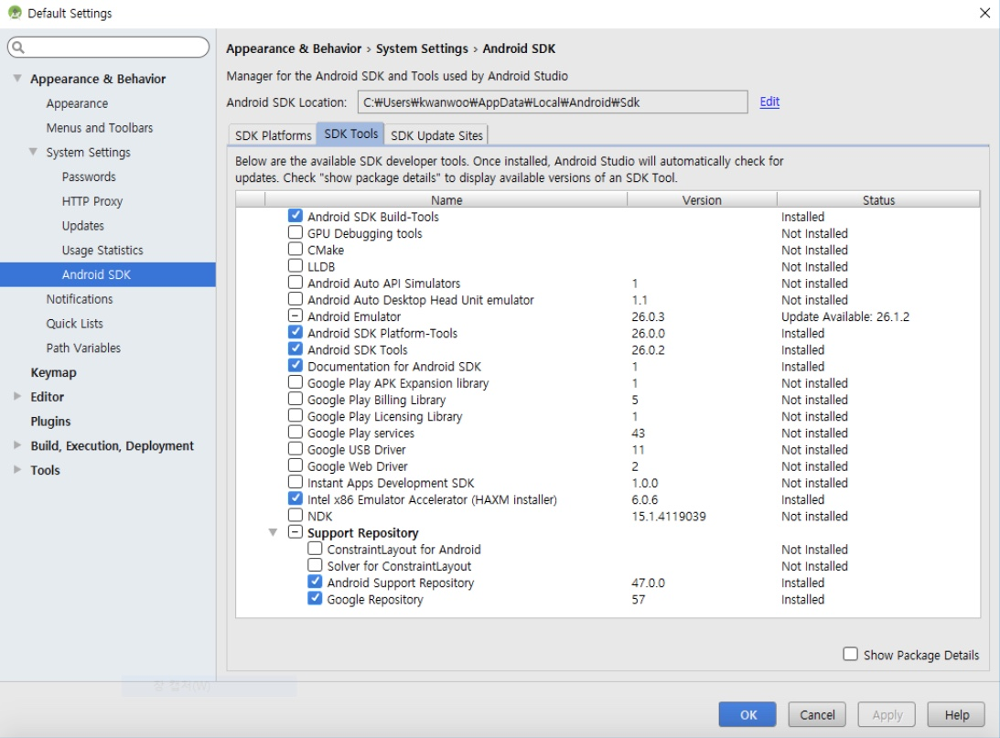

# 개발환경 설치
1. [Java SE Development Kit 8 설치](#install_jdk)
2. [Android Studio 설치](#install_android_studio)
3. [SDK Manager를 이용하여 최신 SDK 도구와 플랫폼을 설치](#sdk_tools_plaforms)

## 1. Java SE Development Kit 8 설치
1. 아래 링크를 클릭하여 JavaSE 다운로드

	[http://www.oracle.com/technetwork/java/javase/downloads/jdk8-downloads-2133151.html](http://www.oracle.com/technetwork/java/javase/downloads/jdk8-downloads-2133151.html)

	

		
	 
	

2. **Accept License Agreement**를 선택후 본인 운영체제에 맞게 다운로드
	* Windows 운영체제
		- 32비트인 경우: Windows x86 다운로드
		- 64비트인 경우: Windows X64 다운로드
	* MAC 운영체제: Mac OS X 다운로드
3. 다운로드한 설치파일을 더블클릭하여 설치 진행
	* Windows 운영체제
		- 32비트인 경우: jdk-8version-windows-i586-i.exe
		- 64비트인 경우: jdk-8version-windows-x64.exe
	* MAC 운영체제: jdk-8uversion-macosx-x64.dmg
4. **Windows** 운영체제 경우에는 환경변수 업데이트
	* [**시작**] - [**제어판**] - [**시스템 및 보안**] - [**시스템**] 클릭
	* [**고급 시스템 설정**] - [**환경 변수**] 클릭하여 **환경 변수** 설정창 오픈
	* *시스템 변수(S)*의 **PATH**를 찾아 선택 후 편집을 눌러, JDK가 설치된 디렉토리의 bin 하위 디렉토리의 경로를 추가. (가령, JDK 가 설치된 디렉토리가 “C:\Program Files\Java\jdk1.8.0_121” 이라면 “C:\Program Files\Java\jdk1.8.0_121\bin” 경로를 추가
	
		

			
		

5. 명령 프롬프트을 열어 javac를 입력하여 아래와 같이 뜨는지 확인

	
	
		
	
	

## 2. Android Studio 설치
1. 아래 링크를 클릭하여 Android Studio 공식 IDE 다운로드 사이트 접속
	
	[https://developer.android.com/studio/index.html](https://developer.android.com/studio/index.html)

	
	
		
	
	
	
2. 사용약관 동의 후에 Android Studio 다운로드

	
	
		
	
	

3. 다운로드한 파일을 더블클릭하여 설치
	 
	<video controls="controls" width="560" height="340">
  	<source type="video/mp4" src="figure/android-studio_installation.mp4"></source>
	</video>
	
## 3. SDK Manager를 이용하여 최신 SDK 도구와 플랫폼을 설치
1. SDK Manager 실행시키기
	다음 두 가지 방법 중 하나를 이용하여 SDK Manger를 실행시킨다.
	- Android Studio 시작 화면 하단의 [**Configure**] 클릭 후, 메뉴에서 [**SDK Manager**] 선택
	
	
	
		
	
	

	- Android Studio 프로젝트 화면에서 [*SDK Manger 아이콘*] 클릭 
2. **SDK Platforms** 탭과 **SDK Tools** 탭에서 필요한 플랫폼과 도구를 설치
	SDK Manager는 앱 개발에 필요한 SDK 플랫폼, SDK 도구, 기타 구성요소를 제공
	- **SDK Platforms** 탭에서 *Android 플랫폼 버전*과 *시스템 이미지*를 최소 하나 이상 설치해야 함
	
		
	
			
		
	
	
	- **SDK Tools** 탭에서 *필수 SDK 도구*와 *권장 지원 리포지토리* 설치
	
		
	
			
		
	
	
		- 필수 SDK 도구
			* Android SDK Build-Tools
			* Android SDK Platform-Tools
			* Android SDK Tools
		- 권장 지원 리포지토리
			* Android Support Repository
			* Google Repository
	
	
