

# 안드로이드 앱 시작하기 
1. [**Android Studio**을 이용한 HelloAndroid 프로젝트 만들기](#start-android)
2. [**에뮬레이터 (Android Virtual Device, AVD)** 만들기](#create-avd)
3. [에뮬레이터에서 HellAndroid 프로젝트 실행하기](#run-helloandroid) 

##  1. **Android Studio**을 이용한 HelloAndroid 프로젝트 만들기

1. [**Android Studio** 시작화면]에서 **Start a new Android Studio project** 선택 
	

		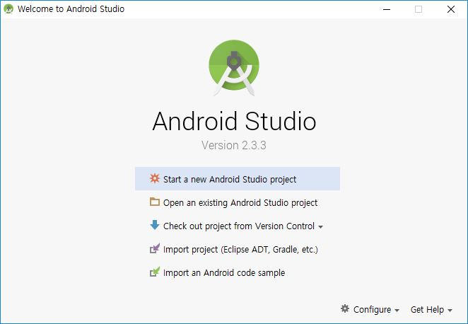
	
	
2. [**Configure your new project** 화면]에서 아래 정보 입력후 [**Next**] 클릭
	- **Application name**: *HelloAndroid* 입력 (안드로이드 앱 프로젝트 이름)
	- **Company domain**: *초기값* 이용 혹은 회사 도메인 주소로 변경
		(입력된 Company domain을 바탕으로 패키지 이름 결정됨) 
	- **Project location**: 안드로이드 앱 프로젝트 파일의 위치, 변경 가능하나 *초기값* 이용 
	

		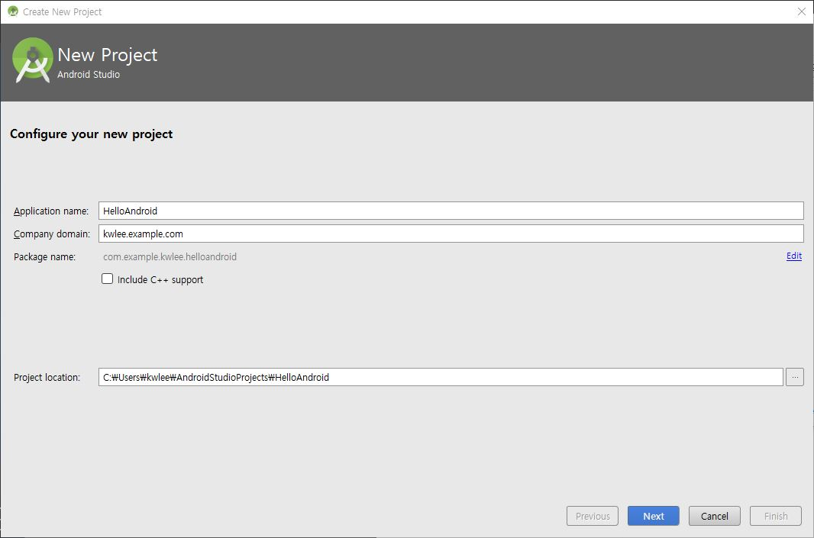
	
	
3. [**Select the form factors your app will run on** 화면]에서 [**Next**] 클릭
	- **Minimum SDK**: 생성한 안드로이드 앱 프로젝트가 실행되는 타겟 디바이스의 최소 SDK 버전 번호로서, 낮을 수록 많은 종류의 타겟 디바이스에서 실행가능하고, 높을수록 최신의 기능을 활용할 수 있음.
	

		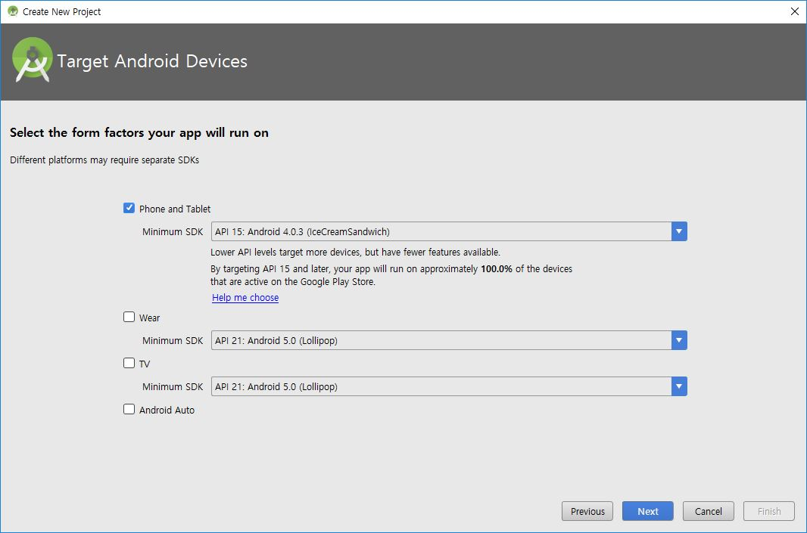
	
	
4. [**Installing Requested Components** 화면]에서 [**Next**] 클릭
5. [**Add an Activity to Mobile** 화면]에서 기본 설정값을 유지한채 [**Next**] 클릭
	
	안드로이드 앱의 화면 템플릿을 선택하는 단계로서, **Empty Activty** 선택
	

		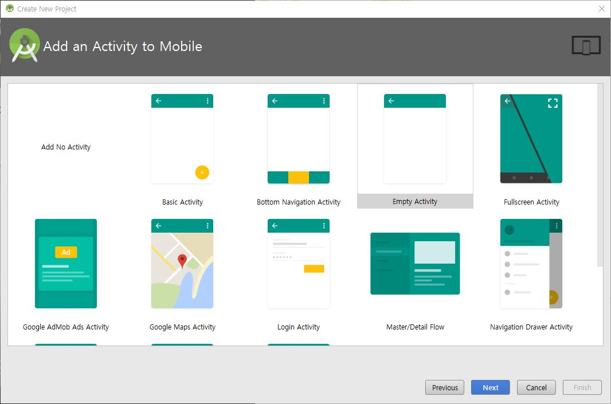
	
	
6. [**Add an Activity to Mobile** 화면]에서 기본 설정값을 유지한채 [**Finish**] 클릭
	
	* **Activity**: 안드로이드 앱 구성요소의 한 종류로서, 화면(GUI)를 제어하는 컴포넌트
	* **Layout**: 화면(GUI)를 정의한 XML 파일로서, **Activity** 컴포넌트에서 사용 됨  
	

		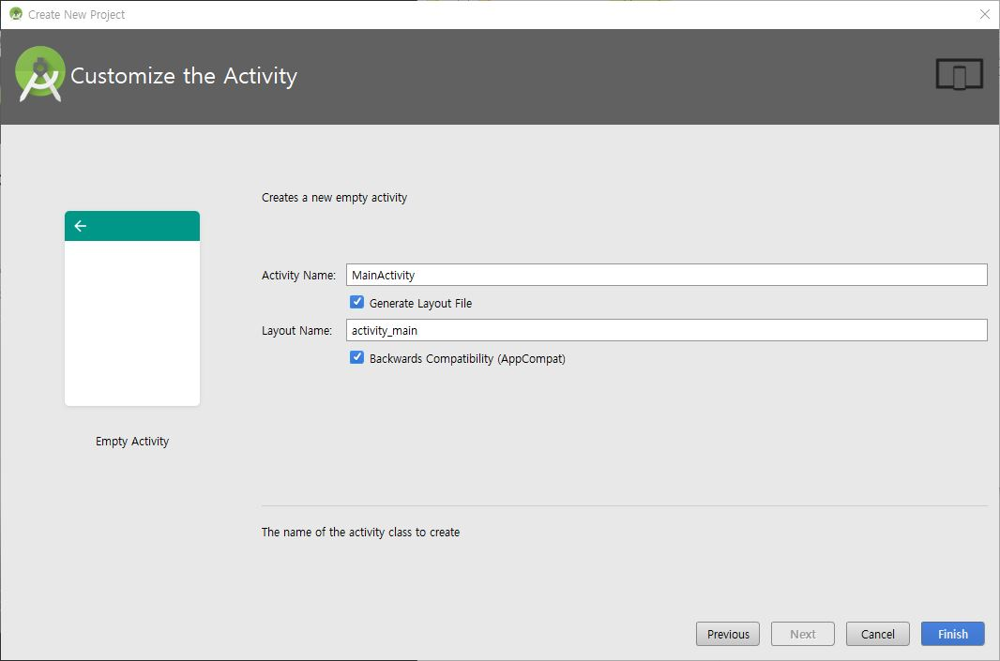
	
	

7. HelloAndroid 프로젝트 생성 및 빌드 후의 화면 
	

		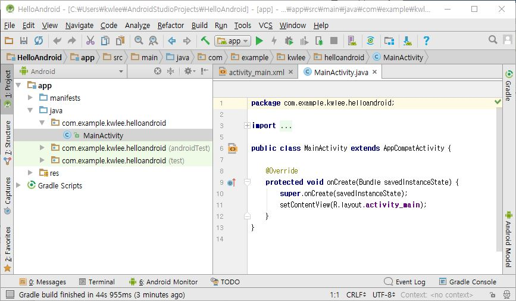
	

##  2. **에뮬레이터 (Android Virtual Device, AVD)** 만들기

1. AVD Manager 실행시키기
	- 안드로이드 스튜디오 프로젝트 화면의 툴바에서 **AVD Manager 아이콘** 클릭 
	

		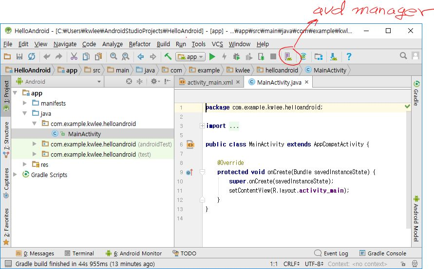
	

	- 안드로이드 스튜디오 프로젝트 화면의 [**Tools**]-[**Android**]-[**AVD Manager**] 메뉴 선택
	

		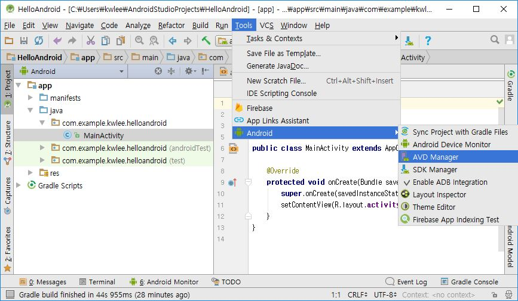
	

2. [**Your Virtual Device** 화면] 에서 [**+ Create Virtual Device**] 버튼 클릭 
	

		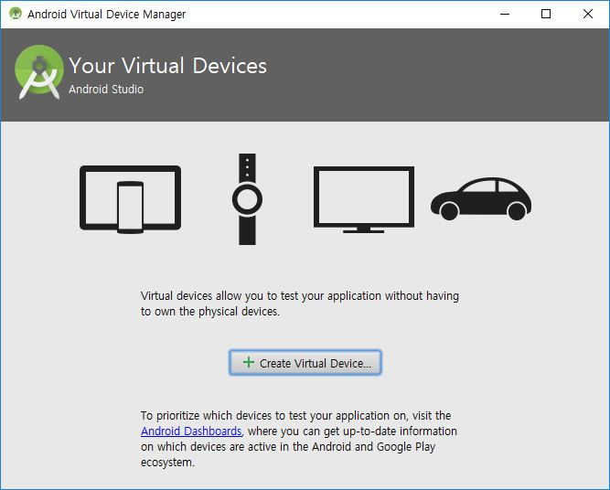
	

3. [**Select Hardware** 화면] 에서 기본 설정값을 유지한 채  [**Next**] 버튼 클릭
	- 디바이스 범주 (Category)와 범주별 디바이스 정의 목록 중에서 원하는 디바이스를 선택한다.
	

		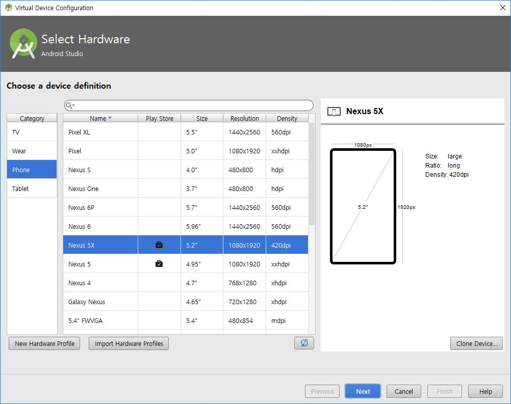
	

4. [**System Image** 화면] 에서 설치된 시스템 이미지 중 하나를 선택하거나, 설치되지 않은 시스템 이미지는 다운로드 후 해당 시스템 이미지를 선택
	- 아래 화면은 x86 Images 탭에서 설치된 시스템 이미지 **Nougat**를 선택한 후, [**Next**] 버튼을 누르는 상황
	 

		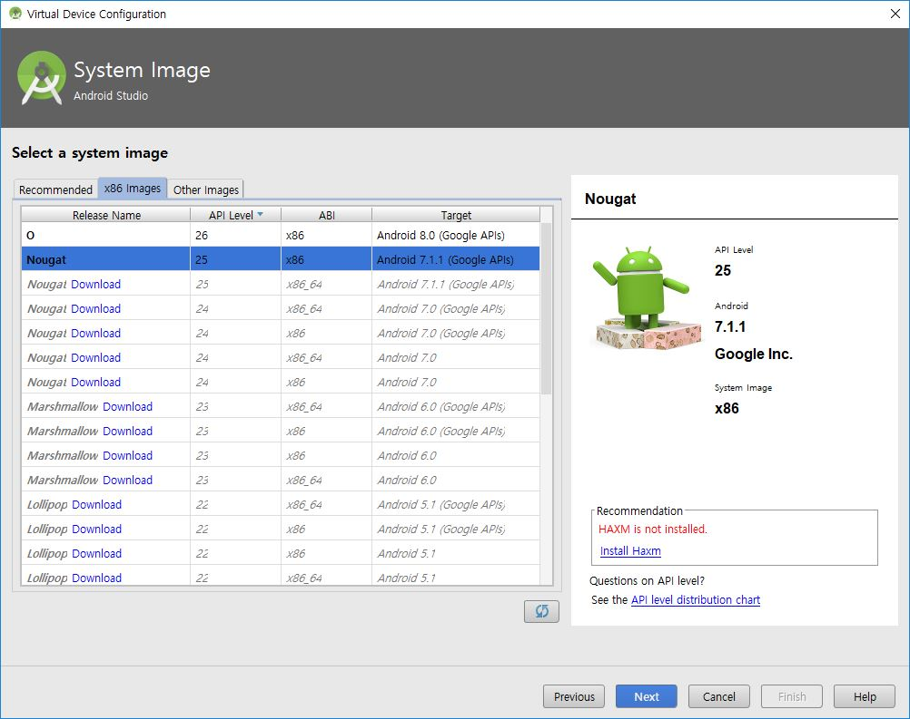
	

5.  [**Android Virtual Device (AVD)** 화면] 에서 기본 설정값을 유지한 채  [**Finish**] 버튼 클릭
	 

		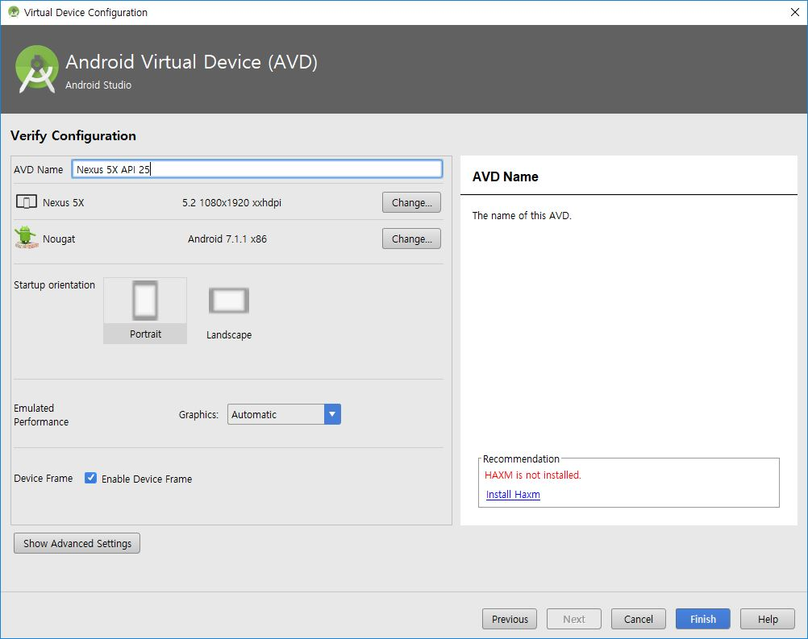
	

	
	- [**AVD Name**]: 새롭게 만들 에뮬레이터의 이름을 알기 쉽게 작명
	- [**Show Advanced Settings**] 버튼을 눌러 **Camera**나 **SD card** 설정을 변경할 수 있음. 
		

			
		

	- **install Haxm** 링크를 클릭하여 Haxm을 설치하면 Intel CPU를 가진 PC에서 에뮬레이터의 실행성능을 향상시킬 수 있다. 
		

			
		

6. 에뮬레이터 생성 결과
	

		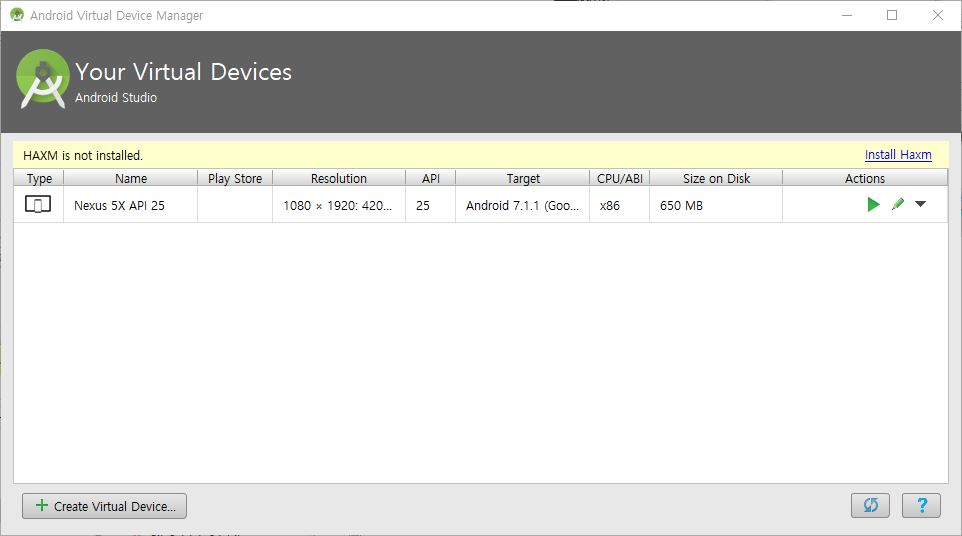
	

	- [**+ Create Virtual Device**] 버튼을 클릭하여 에뮬레이터를 추가로 만들 수 있음 

##  3. 에뮬레이터에서 HellAndroid 프로젝트 실행하기 

1. 에뮬레이터 실행시키기 
	- AVD Manager의 Virtual Devices 목록에에 실행할 에뷸레이터를 선택하고 연두색 삼각형 버튼을 눌러 에뮬레이터를  실행함
	

		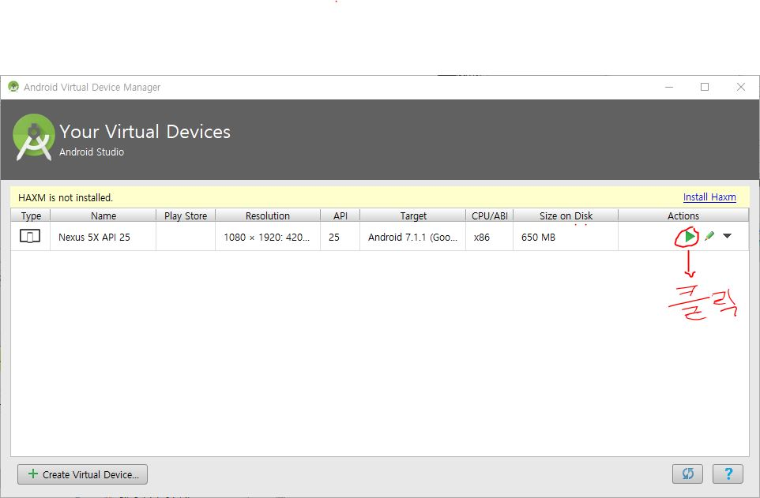
	

2. 실행결과
	

		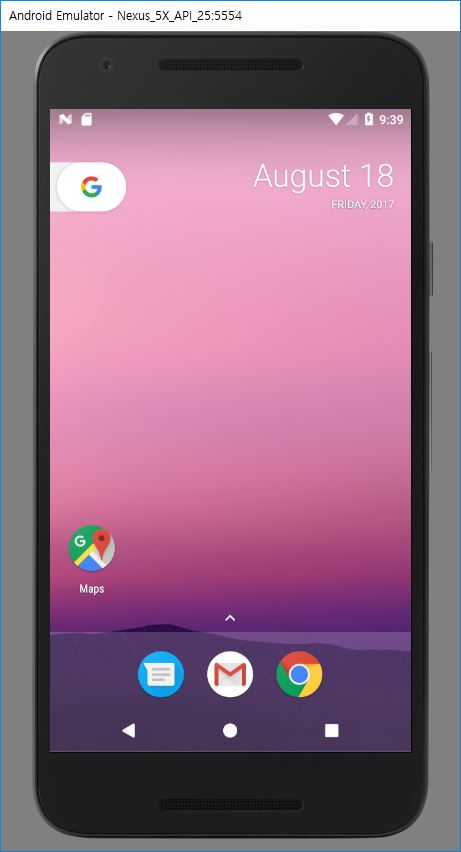
	

3. HelloAndroid 프로젝트 화면에서 프로젝트 실행시키기
	- [**Run**]-[**Run 'app'**] 메뉴 실행 또는
	- 툴바의 실행 아이콘 클릭
		

			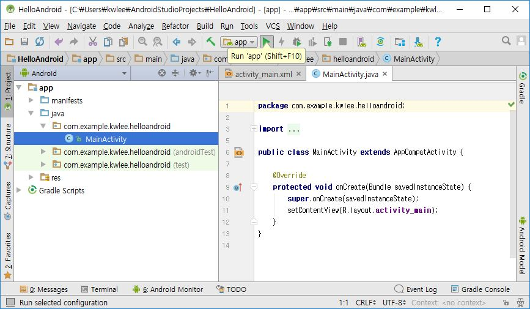
		
	
4. 실행시킬 디바이스 선택하기 
	- [**Select Deployment Target**] 화면에서 실행시킬 디바이스(에뮬레이터)를 선택 후, [**OK**] 버튼 클릭
		

			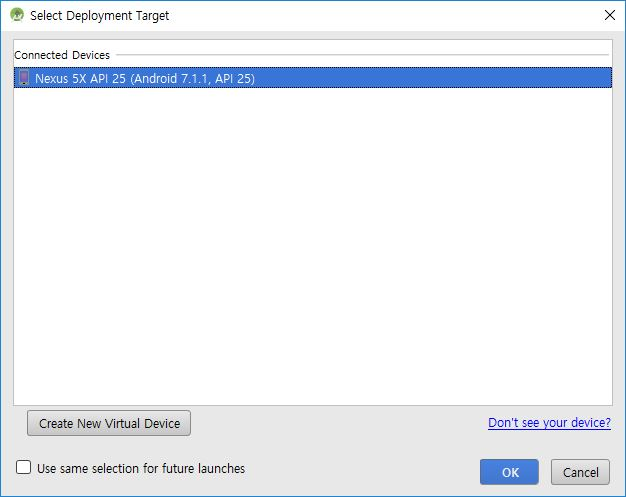
		
	
5. 에뮬레이터에서 HelloAndroid 실행결과
	

		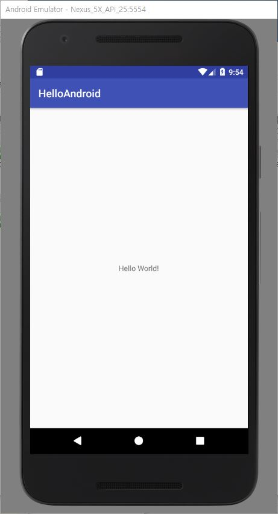
	

